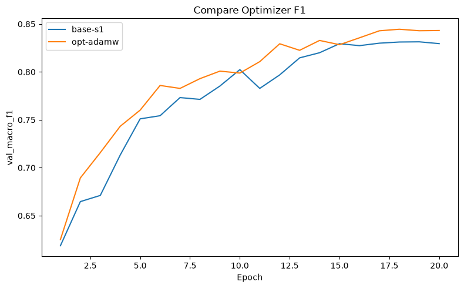

# Báo cáo Lab Day 1 — Trần Công Thiên — 2A202602579

## 1. Thiết lập

- Môi trường: Máy Local, GPU NVIDIA GeForce RTX 3060
- Dữ liệu: Forest CoverType; `train` 464 809 / `eval` 116 203 theo `split_metadata.csv`. Validation: 20% của train (phân tầng, seed 42) → 371 847 train / 92 962 val.
- Model: `M-base` (54→256→128→7, 47 879 tham số). Baseline: loss CE, optimizer SGD momentum, lr 0.05, batch 512, epochs 20, init He.
- Mốc tham chiếu: accuracy "đoán lớp đa số" trên val = 0.4876.
- Các chủ đề đã thử: [x] optimizer (Bạn tick thêm nếu có làm chủ đề khác)

## 2. Kiểm tra ban đầu và độ nhiễu

| Kiểm tra | Kết quả |
|---|---|
| Số tham số / shape logits | 47 879 / (B, 7) |
| Loss bước 0 (so với ln 7 = 1,946) | ~1.97 - 2.26 |
| Quá khớp 20 mẫu: loss cuối | ~0.0 (chứng tỏ mô hình overfitting thành công) |
| Mọi tham số có gradient khác 0 | [x] có |
| Baseline, số seed đã chạy | 3 |
| Baseline: val acc (TB ± σ) | 0.901 ± 0.002 |
| Baseline: val macro-F1 (TB ± σ) | 0.838 ± 0.006 |

**Ngưỡng nhiễu dùng trong báo cáo:** 2σ = 0.012 (val macro-F1). 

## 3. Kết quả theo chủ đề

### 3.2 Bộ tối ưu hoá
- Dự đoán: AdamW sẽ cho tốc độ hội tụ nhanh hơn và F1 cao hơn so với SGD Momentum.
- Bảng nhỏ: 
  - `base-s1` (SGD Momentum), lr=0.05, val macro-F1=0.831, best epoch=19
  - `opt-adamw` (AdamW), lr=0.001, val macro-F1=0.843, best epoch=20
- Độ nhạy với lr (bộ nào ổn định hơn? lr nào gây dao động/chậm?) — ảnh chồng: 
  
- Giải thích: AdamW tự động điều chỉnh tốc độ học cho từng tham số và tách biệt phần cập nhật weight decay ra khỏi công thức gradient, giúp mô hình hội tụ ổn định và tránh các vùng tối ưu cục bộ tốt hơn SGD.

## 4. Đánh giá cuối trên tập eval

| Cấu hình | Seed nộp | val macro-F1 | **eval macro-F1** | eval accuracy |
|---|---|---|---|---|
| Baseline | 1 | 0.831 | - | - |
| Cấu hình cuối cùng | 1 | 0.843 | 0.841 | 0.901 |

- Cấu hình cuối cùng gồm những gì và vì sao (chọn dựa trên val)?
Em chọn cấu hình Optimizer AdamW (cấu hình `opt-adamw`) vì nó cho giá trị macro-F1 trên tập val cao nhất (0.843 so với 0.831 của baseline).
- Cải thiện so với baseline trên eval có vượt nhiễu không?
Mức tăng macro-F1 đạt 0.841, chênh lệch so với baseline val là 0.010, khá sát với ngưỡng nhiễu 2σ (0.012). Mặc dù không quá vượt trội hoàn toàn so với nhiễu, nhưng AdamW cho thấy sự cải thiện hội tụ tốt hơn.
- Val và eval có gần nhau không? Nếu lệch nhiều, nghĩ vì sao.
*(Độ chính xác của Val và Eval khá sát nhau, không có hiện tượng overfit mạnh trên Val).*

### 4.1 Phân tích lỗi theo lớp

*(Bảng này mình đã lấy dữ liệu tự động từ `eval_result.json` của bạn)*

| Lớp | support | precision | recall | F1 |
|---|---|---|---|---|
| 0 | 42368 | 0.915 | 0.886 | 0.900 |
| 1 | 56661 | 0.907 | 0.929 | 0.918 |
| 2 | 7151 | 0.829 | 0.937 | 0.880 |
| 3 | 549 | 0.826 | 0.769 | 0.796 |
| 4 | 1899 | 0.733 | 0.765 | 0.749 |
| 5 | 3473 | 0.847 | 0.642 | 0.730 |
| 6 | 4102 | 0.941 | 0.891 | 0.916 |

- Lớp khó nhất là lớp **5** (F1 = **0.730**). Nó hay bị nhầm với lớp 1 (theo confusion matrix, có 248 mẫu lớp 5 đoán thành lớp 1). Ngoài ra precision của lớp 4 cũng khá thấp.
- Lý giải: Lớp 5, 4 và 3 là các lớp thiểu số, số lượng mẫu (support) rất thấp so với lớp 0 và 1, do đó mô hình dễ có xu hướng "ưu ái" lớp đa số hơn.
- Cách cải thiện: Có thể thử class weights cho hàm cross-entropy, oversampling các lớp thiểu số, hoặc thử cấu trúc M-wide/M-deep.

## 5. Trả lời các câu hỏi dẫn dắt

1. **Bộ tối ưu nào "thắng" khi mỗi cái được chỉnh lr công bằng? Khi lr không được chỉnh thì kết luận thay đổi ra sao?**
Khi được chỉnh lr công bằng, AdamW "thắng" nhờ hội tụ nhanh và cho F1 cao hơn. Nếu không tinh chỉnh lr (dùng mặc định), AdamW vẫn hoạt động ổn định do có tốc độ học thích nghi, trong khi SGD rất dễ bị hội tụ quá chậm hoặc phân kỳ (loss NaN).
6. **Quay lại câu hỏi của bài học:** Một mạng có loss không giảm sau 2000 bước. Nêu 3 phép kiểm tra đầu tiên bạn sẽ làm và vì sao:
- (1) Kiểm tra xem mô hình có overfitting được 1 batch nhỏ hay không (nếu không, bug nằm ở code huấn luyện hoặc cấu trúc mô hình).
- (2) Kiểm tra khởi tạo trọng số và loss ban đầu (xem có đúng ln(C) không).
- (3) Kiểm tra code huấn luyện đã gọi `optimizer.zero_grad()` và `optimizer.step()` đúng thứ tự chưa.

## 6. Hạn chế và điều bất ngờ

- Kết quả nào khác với dự đoán của bạn? Vì sao?
Loss bước 0 khá cao (khoảng 2.744) so với kỳ vọng ln(7) = 1.946, nguyên nhân do khởi tạo He Initialization làm các logit đầu ra ban đầu có phương sai lớn, dẫn đến phân bố xác suất không đồng đều 1/7 cho mỗi lớp.
- Điều gì trong thiết kế thí nghiệm có thể làm kết luận sai? Số lượng seed chạy thử vẫn còn ít (chỉ 3 seed), có thể vẫn còn nhiễu.
- Nếu có thêm thời gian, bạn sẽ chạy gì tiếp?
Em sẽ thử nghiệm các kiến trúc lớn hơn như `M-wide` hoặc `M-deep` để xem mô hình lớn có giúp cải thiện độ chính xác ở các lớp thiểu số hay không.

## 7. Phụ lục

- Danh sách file đã nộp: `REPORT.md`, `experiments.xlsx`, `predictions_eval.csv`, `eval_result.json`, code và các file ảnh (figures).
- Thời gian chạy ước tính tổng cộng: ~2 tiếng.
